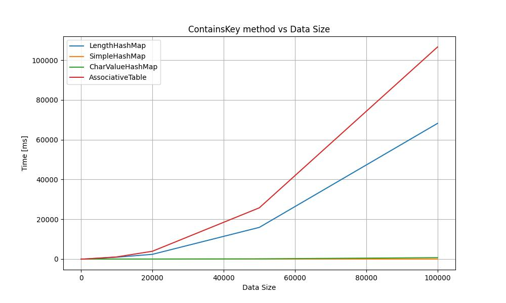

# DataStructures

This repository contains a collection of data structures implemented in C#. It provides various associative mapping data structures, including a HashMap, implemented using a base map and nodes.

## Repository Structure

The repository structure is organized as follows:

```
DataStructures
│   .gitignore
│   LICENSE
│
├───.github
│   └───workflows
│           dotnet.yml
│
├───results
│       ContainsKey_plot.jpg
│       ContainsKey_plot_log.jpg
│       Get_plot.jpg
│       Get_plot_log.jpg
│       performanceData.json
│       plots.py
│       Put_plot.jpg
│       Put_plot_log.jpg
│       Remove_plot.jpg
│       Remove_plot_log.jpg
│
├───src
│   └───DataStructures
│          AssociativeTable.cs
│          BaseMap.cs
│          DataStructures.csproj
│          DataStructures.sln
│          HashMap.cs
│          Node.cs
│          Program.cs
│       
└───tests
    └───DataStructuresTests
           AssociativeTableTests.cs
           DataStructuresTests.csproj
           DataStructuresTests.sln
           HashMapTests.cs
           Usings.cs
```

## Prerequisites

- [.NET 6.0 SDK](https://dotnet.microsoft.com/download/dotnet/6.0)

## Getting Started

To use the data structures in this repository, follow these steps:

1. Clone the repository:

   ```bash
   git clone https://github.com/your-username/DataStructures.git
   ```

2. Navigate to the repository's root directory:

   ```bash
   cd DataStructures
   ```

3. Build the solution:

   ```bash
   dotnet build src/DataStructures/DataStructures.sln
   ```

4. Run the program:

   ```bash
   dotnet run --project src/DataStructures/DataStructures.csproj
   ```

## Running Tests

This repository includes unit tests for the data structures. To run the tests, follow these steps:

1. Navigate to the `tests/DataStructuresTests` directory:

   ```bash
   cd tests/DataStructuresTests
   ```

2. Run the tests:

   ```bash
   dotnet test
   ```

## Dependencies

- [Newtonsoft.Json](https://www.newtonsoft.com/json) - Version 13.0.3
- [Microsoft.NET.Test.Sdk](https://www.nuget.org/packages/Microsoft.NET.Test.Sdk) - Version 17.3.2
- [xunit](https://xunit.net) - Version 2.4.2
- [xunit.runner.visualstudio](https://www.nuget.org/packages/xunit.runner.visualstudio) - Version 2.4.5
- [coverlet.collector](https://www.nuget.org/packages/coverlet.collector) - Version 3.1.2

## Performance

This repository includes performance plots to showcase the performance characteristics of the implemented data structures. The plots demonstrate the time complexity or memory usage of the data structures.

### Generating Performance Plots

1. Ensure that you have Python installed on your system.

2. Run the following command to generate the performance plots:

   ```bash
   python results/plots.py
   ```

   This script will generate the necessary performance plots based on the provided data.

### Performance Plots

The following performance plots illustrate the performance of the data structures:


*ContainsKey Plot - Performance comparison of the ContainsKey operation.*


*Get Plot - Performance comparison of the Get operation.*


*Put Plot - Performance comparison of the Put operation.*


*Remove Plot - Performance comparison of the Remove operation.*

## License

This project is licensed under the [MIT License](LICENSE).

## Acknowledgments

- This project uses the [Newtonsoft.Json](https://www.newtonsoft.com/json) library for JSON serialization.

## Related Projects

- [SortingAlgorithms](https://github.com/pietrykovsky/SortingAlgorithms): Implementation of various sorting algorithms in C#, such as bucket sort, merge sort and quick sort.
